<h2>Olá! Seja bem-vindo(a). 👋</h2>

  

 

Olá! Meu nome é **Luan Castro**. Tenho interesse em tecnologia e estou desenvolvendo meus conhecimentos em programação, bancos de dados e computação em nuvem.

Busco transformar ideias em soluções digitais, aprender novas ferramentas e construir projetos que contribuam para minha evolução profissional.

Atualmente, meu foco está no desenvolvimento de aplicações, APIs, manipulação de dados e serviços em nuvem.

### Áreas de interesse

`Desenvolvimento de Software` · `Aplicações Web` · `APIs` · `Bancos de Dados` · `Cloud Computing`

### Tecnologias e ferramentas

  
  
  
  
  
  
  
  

### Informações

- 💻 Estou desenvolvendo novos projetos para ampliar meu portfólio.
- 📚 Atualmente estudo desenvolvimento, dados e serviços em nuvem.
- 🎯 Tenho como objetivo evoluir constantemente como desenvolvedor.
- 🤝 Estou disponível para conexões e oportunidades profissionais.
- 📍 Brasil.

### Estatísticas

  
  

### Contato

  
  

 

  

